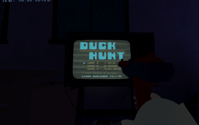
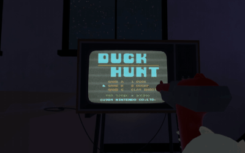
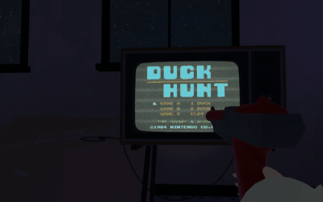
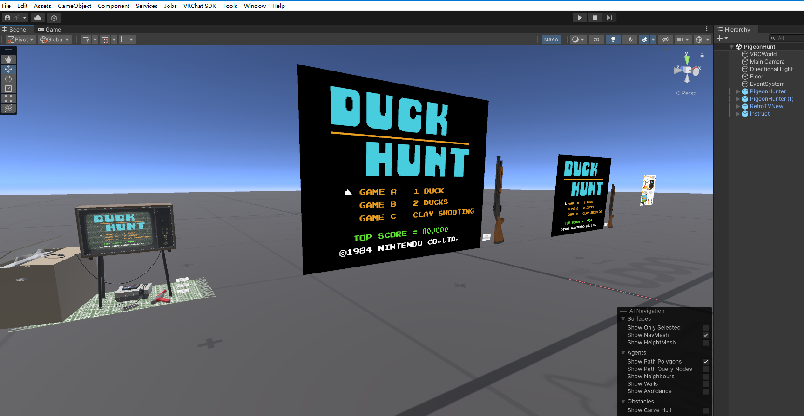

# PigeonHunter

## Game Preview

https://x.com/qychui/status/2057009900312842413

## English

### Project Overview

Pigeon Hunt is a retro Famicom / NES-style shooting mini-game for VRChat. The author's original plan was to first complete the game using publicly available Duck Hunt-style assets, then replace the assets and expand the features to turn it into a true Pigeon Hunt project. However, since the project has been delayed for too long, it is now being wrapped up directly.

The project recreates about 95% of the original Famicom / NES Duck Hunt gameplay, and includes simple multiplayer synchronization and a retro TV shader.

### Game Modes

**Mode A: Single Pigeon Mode**

One pigeon spawns in each wave, for a total of 10 waves.

**Mode B: Pair Pigeon Mode**

Two pigeons spawn in each wave, for a total of 5 waves.

**Mode C: Shooting Range Mode**

Two clay targets are launched in each wave, for a total of 5 waves.

### Gun Features

The gun includes basic shooting, gunshot audio, muzzle particles, shot flash objects, hit detection, and laser aiming assistance.

The player who picks up the gun will attempt to become the current gameplay owner. When the gun fires, local effects are triggered, and key effects are synchronized to other clients through SyncController, including gunshot audio, muzzle particles, shot flash, hit events, and miss-shot events.

The laser supports three states:

- Off
- Line + dot
- Dot only

Double-clicking the use input switches the laser display mode. When the gun is picked up, remote clients can also see the laser. When the gun is dropped, the laser is hidden in sync.

### Multiplayer Synchronization

The project uses lightweight synchronization. It does not aim for perfectly identical frame-by-frame simulation, but instead synchronizes key gameplay checkpoints.

Synchronized data includes:

- Main menu selected mode
- Game start mode
- Mode A / Mode B round random seed
- Pigeon spawn plan
- Hit events
- Miss-shot events
- Round result
- Mode C clay target wave random seed
- Mode C hit and miss-shot events
- Top score
- Gunshot audio, muzzle particles, and shot flash
- Gun laser display state

Mode A and Mode B pigeon movement is not synchronized frame by frame. Instead, each round synchronizes a seed, allowing different clients to use the same random data for pigeon generation, launch direction, boundary deflection, and random direction changes after shooting.

Mode C uses a wave seed to synchronize clay target generation data. Since each clay target has a relatively consistent lifecycle, synchronization focuses on wave start, hit events, miss-shot events, and round snapshots.

### Owner Rules

Whoever picks up the gun will attempt to become the gameplay owner. The owner is responsible for sending key synchronization events such as hits, miss shots, round plans, and round results.

If the owner changes during gameplay, the new owner will continue sending synchronization data through later actions. If multiple Pigeon Hunt instances exist in the same scene, each gun only affects the GameManager it belongs to, preventing guns from one instance from shooting the wrong screen.

### Late Join Handling

When a new player joins during gameplay, the project does not forcefully rebuild all currently running animation states immediately. Instead, it tends to realign before the next round or wave. This reduces abrupt teleporting and animation jumps.

Mode C supports round snapshots, allowing late joiners to align with the current stage, score, and difficulty before the next round.

### Animations and Shaders

Dog jump animation:

- Changes Canvas sorting order at the highest point of the jump
- Optional switch to hide the dog object after the jump
- Low-probability `lmfao_VRCDog` variant for wave miss and round fail
- The probability uses the synchronized seed to keep multiplayer clients consistent

The project also includes a Retro TV-style display effect that can be overlaid on UI, simulating an old TV screen with noise, scanlines, flicker, flashes, and glow.

### Main Configuration

Common GameManager settings include:

- `pigeonsPerRound`: number of pigeons per round
- `spawnDelay`: delay between waves
- `pairModeWaveCount`: number of waves in pair pigeon mode
- `roundDifficultyStep`: difficulty increase per round
- `maxDifficultyMultiplier`: maximum difficulty multiplier
- `pigeonBoundaryRandomDeflectionChanceBase`: initial chance for random boundary deflection
- `pigeonBoundaryRandomDeflectionChanceStepPerRound`: boundary deflection chance increase per round
- `pigeonBoundaryRandomDeflectionChanceMax`: maximum chance for random boundary deflection
- `shotDirectionChangeChance`: chance for pigeons to randomly change direction after a shot
- `shootingRangeWaveCount`: number of waves per Mode C round
- `shootingRangeClayLifetimeMax / Min`: clay target lifetime range
- `enableGunShotFlashObjects`: whether to enable shot flash objects
- `gunShotFlashDuration`: duration of the shot flash
- `screenRetroTvMask`: Retro TV mask object

Common GunController settings include:

- `fireOrigin`: raycast origin
- `fireCooldown`: shooting cooldown
- `distance`: shooting detection distance
- `hitMask`: hittable layers
- `muzzleFlash`: muzzle particles
- `shootSfx / clayHitSfx`: gunshot audio
- `laserLine / laserHitDot`: laser line and hit dot
- `laserDisplayMode`: laser display mode

Common MainAreaAnimationController settings include:

- References for each dog state object
- Hit / miss / round start / round next animation timing
- Dog jump movement parameters
- `lmfao_VRCDog`
- `lmfaoVRCDogChance`
- `hideDogAfterArcPeak`
- `hideDogAfterArcPeakDelay`

### Folder Structure

- `Animations`: animation assets
- `Materials`: material assets
- `Models`: model assets
- `Prefabs`: main prefabs, including PigeonHunter
- `Scenes`: sample scenes
- `Shaders`: custom shaders such as RetroTV, Score, and Timed Color Switch
- `Sounds`: audio assets
- `Textures`: texture assets
- `UScripts`: UdonSharp scripts

### Notes

This project uses checkpoint-style synchronization rather than full frame-by-frame synchronization. Therefore, small timing differences between clients may still occur. The project uses round seeds, wave seeds, and key event synchronization to reduce differences.

When modifying target movement logic, random logic, or round flow, make sure the owner and remote clients use the same seed. Otherwise, target generation or random events may become desynchronized.

### Credits / License Template

You can include the following in the world description:

Special thanks to the following asset creators for supporting this project:

- "Duck Hunt Cartridge" (https://skfb.ly/6BAYI) by BIGDOGLOBAL is licensed under Creative Commons Attribution-NoDerivs (http://creativecommons.org/licenses/by-nd/4.0/).
- "NES Zapper" (https://skfb.ly/onJZv) by Thomas Fugier is licensed under Creative Commons Attribution (http://creativecommons.org/licenses/by/4.0/).
- "NES Console and Controller" (https://skfb.ly/onGrq) by Daz is licensed under Creative Commons Attribution (http://creativecommons.org/licenses/by/4.0/).
- "Retro TV set new, old, broken" (https://skfb.ly/o7uKC) by Bansheeva is licensed under Creative Commons Attribution (http://creativecommons.org/licenses/by/4.0/).

---

## 中文

### 项目简介

Pigeon Hunt 是一个VRChat的复古FC射击小游戏，虽然作者最早的想法是先使用公开的打鸭子素材完成游戏，再接着替换素材和丰富功能以此实现真正的Pigeon Hunt，不过这个项目拖的太久了，就打算直接完结掉它了。

项目复刻了原版FC打鸭子95%的功能，实现了简单的多人同步和复古电视shader。

### 游戏模式

**Mode A：单鸽模式**

每一波生成一只鸽子，一共10波。

**Mode B：双鸽模式**

每一波生成两只鸽子，一共5波。

**Mode C：靶场模式**

每波发射两个飞盘，一共5波。

### 枪械功能

枪械包含基础射击、枪声、枪口粒子、开枪闪屏物体、命中检测和镭射辅助。

拿起枪械的玩家会尝试成为当前 gameplay owner。枪械开火时会触发本地效果，并通过 SyncController 向其他客户端同步关键效果，例如枪声、枪口粒子、开枪闪屏、命中事件和空枪事件。

镭射支持三种状态：

- 关闭
- 线段 + 红点
- 仅红点

双击使用键可以切换镭射显示模式。枪械被拾取时，远端客户端也可以看到镭射，放下后会同步隐藏。

### 多人同步设计

项目采用轻量同步方式，不追求逐帧完全一致，而是同步关键节点。

同步内容包括：

- 主菜单选中模式
- 游戏开始模式
- Mode A / Mode B 每回合随机种子
- 鸽子生成计划
- 命中事件
- 空枪事件
- 回合结算结果
- Mode C 每波飞盘随机种子
- Mode C 命中和空枪事件
- 最高分
- 枪声、枪口粒子、开枪闪屏
- 枪械镭射显示状态

Mode A 和 Mode B 的鸽子运动轨迹不会逐帧同步。项目通过每回合同步 seed，让不同客户端使用同一套随机数据生成鸽子、发射方向、边界反弹偏转和射击后随机转向。

Mode C 使用 wave seed 同步飞盘生成数据。因为每个飞盘生命周期相对统一，因此同步重点放在每波开始、命中、空枪和回合快照上。

### Owner 规则

谁拾取枪械，谁会尝试成为 gameplay owner。owner 负责发送关键同步事件，例如命中、空枪、回合计划和回合结果。

如果 owner 中途变化，新 owner 会在后续操作中继续发送同步数据。场景中如果存在多个 Pigeon Hunt 实例，枪械只会影响它所属的 GameManager，避免其它实例的枪打到错误屏幕。

### 新玩家加入

新玩家中途加入时，项目不会强制立刻重建所有正在进行的动画状态，而是倾向于在下一个 round 或 wave 前进行同步校准。这样可以减少突兀瞬移和动画跳变。

Mode C 支持 round snapshot，用于让中途加入的玩家在下一轮前对齐当前关卡、分数和难度。

### 动画与着色器

狗子跳跃动画：

- 跳跃时按最高点切换 Canvas sorting order
- 跳跃后隐藏狗对象的可选开关
- wave miss 和 round fail 时低概率触发替代的 `lmfao_VRCDog`
- 该概率使用同步 seed，确保多人客户端结果一致

项目还包含 Retro TV 风格显示效果，可用于覆盖 UI，模拟老电视画面、噪点、扫描线、闪屏和辉光。

### 主要配置项

GameManager 中常用配置包括：

- `pigeonsPerRound`：每回合鸽子数量
- `spawnDelay`：每波之间的延迟
- `pairModeWaveCount`：双鸽模式波数
- `roundDifficultyStep`：每回合难度增长
- `maxDifficultyMultiplier`：最大难度倍率
- `pigeonBoundaryRandomDeflectionChanceBase`：边界随机偏转初始概率
- `pigeonBoundaryRandomDeflectionChanceStepPerRound`：每回合偏转概率增长
- `pigeonBoundaryRandomDeflectionChanceMax`：边界随机偏转最大概率
- `shotDirectionChangeChance`：开枪后鸽子随机转向概率
- `shootingRangeWaveCount`：Mode C 每回合波数
- `shootingRangeClayLifetimeMax / Min`：飞盘生命周期范围
- `enableGunShotFlashObjects`：是否启用开枪闪屏物体
- `gunShotFlashDuration`：闪屏持续时间
- `screenRetroTvMask`：Retro TV 遮罩物体

GunController 中常用配置包括：

- `fireOrigin`：射线发射点
- `fireCooldown`：射击冷却
- `distance`：射击检测距离
- `hitMask`：可命中 Layer
- `muzzleFlash`：枪口粒子
- `shootSfx / clayHitSfx`：枪声
- `laserLine / laserHitDot`：镭射线和命中点
- `laserDisplayMode`：镭射显示模式

MainAreaAnimationController 中常用配置包括：

- 狗狗各状态对象引用
- 命中 / miss / round start / round next 动画时间
- 狗狗跳跃位移参数
- `lmfao_VRCDog`
- `lmfaoVRCDogChance`
- `hideDogAfterArcPeak`
- `hideDogAfterArcPeakDelay`

### 目录结构

- `Animations`：动画资源
- `Materials`：材质资源
- `Models`：模型资源
- `Prefabs`：主要 prefab，包括 PigeonHunter
- `Scenes`：示例场景
- `Shaders`：自定义 shader，例如 RetroTV、Score、Timed Color Switch
- `Sounds`：音频资源
- `Textures`：贴图资源
- `UScripts`：UdonSharp 脚本

### 注意事项

本项目的同步方式是关键帧式同步，不是完整逐帧同步。因此不同客户端之间可能存在轻微时间差。项目通过 round seed、wave seed 和关键事件同步来降低差异。

如果修改目标运动逻辑、随机逻辑或回合流程，需要注意 owner 和远端是否会使用同一套 seed，否则可能导致生成结果或随机事件不同步。

### 致谢 / 授权模板

可以在世界说明中加入：

感谢以下素材作者对本项目的支持：

- "Duck Hunt Cartridge" (https://skfb.ly/6BAYI) by BIGDOGLOBAL is licensed under Creative Commons Attribution-NoDerivs (http://creativecommons.org/licenses/by-nd/4.0/).
- "NES Zapper" (https://skfb.ly/onJZv) by Thomas Fugier is licensed under Creative Commons Attribution (http://creativecommons.org/licenses/by/4.0/).
- "NES Console and Controller" (https://skfb.ly/onGrq) by Daz is licensed under Creative Commons Attribution (http://creativecommons.org/licenses/by/4.0/).
- "Retro TV set new, old, broken" (https://skfb.ly/o7uKC) by Bansheeva is licensed under Creative Commons Attribution (http://creativecommons.org/licenses/by/4.0/).
